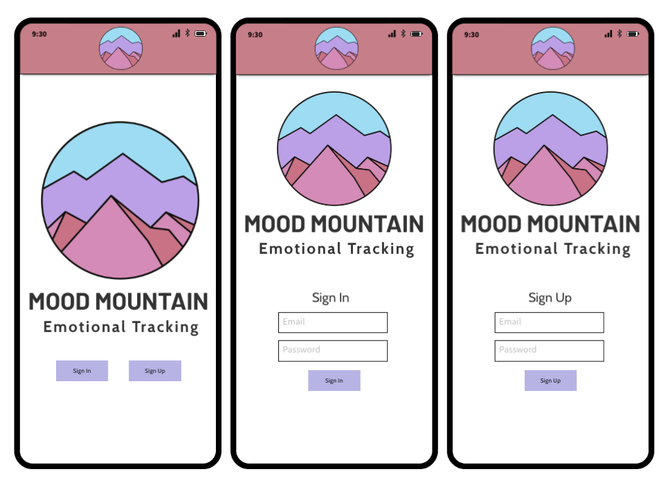
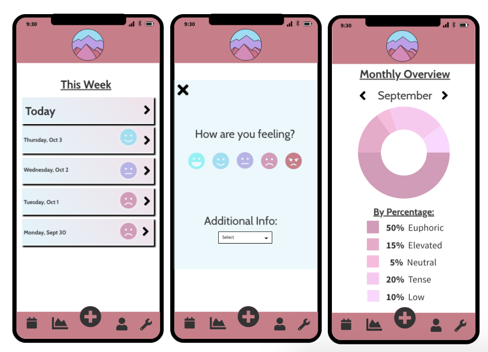
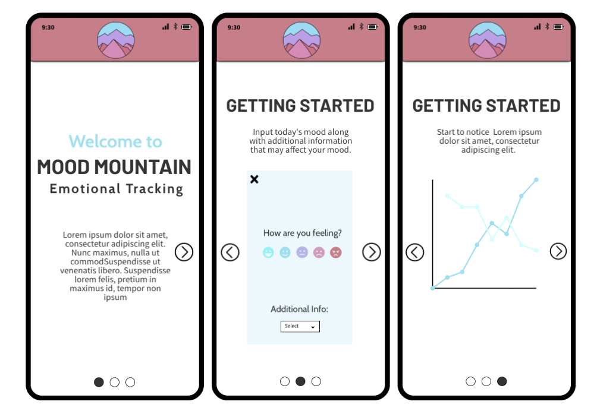

# Mood Mountain

## Overview

Mood Mountain is an emotional tracking app. Users are able to make daily entries on feelings

[Mood Mountain](https://moodmountain.herokuapp.com/)

[Trello](https://trello.com/b/MtRJppKw/moodtracker)

## Wireframe

## User Stories

As a user I want to:
	
- sign up or log in 

- track my daily emotions

- view my emotions of a weekly, monthly and yearly basis

- choose a color theme that matches my style

## Technologies Used
HTML, CSS, Mongoose, Express JS, React JS, Node JS, Heroku, ApexCharts 

## Stretch Goals

- Add additional mood factors including: *Hours of Sleep, Hours of Work, Caffeine Intake, Water Intake, Number of Meals/Skipped Meals, Taken medicine, Period cycle*

- Tips for dealing with moods
- Mood Journal
- Daily reminder push notifications